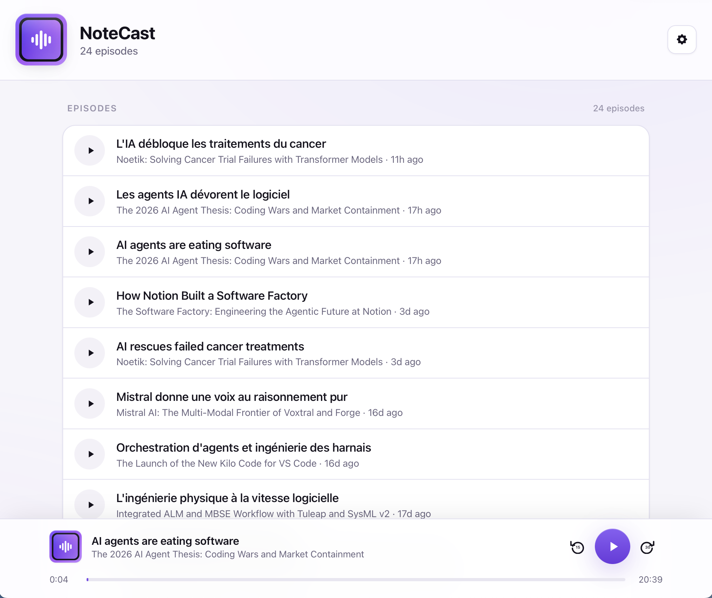
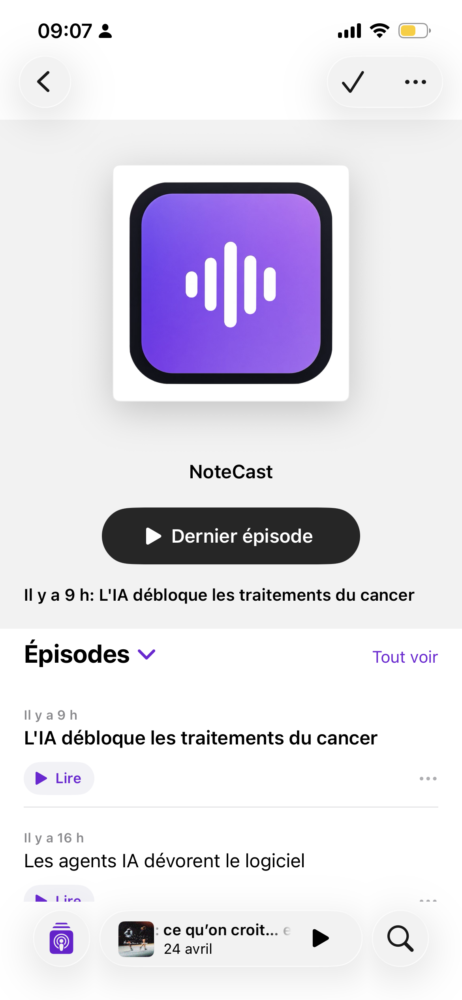

# NoteCast

Turns your RSS feeds into AI-generated podcast episodes via NotebookLM, served over HTTPS.

> **Disclaimer:** NoteCast uses [notebooklm-py](https://github.com/teng-lin/notebooklm-py), an **unofficial** reverse-engineered client for NotebookLM. It is not affiliated with or endorsed by Google. Use at your own risk — Google may change their API or ToS at any time.





## How it works

**YouTube feeds** (natively supported by NotebookLM):
```
YouTube channel RSS → poller → NotebookLM (video URL) → audio overview → download → RSS feed
```

**Regular RSS/podcast feeds** (Whisper transcription path):
```
RSS/Atom feed → poller → Whisper (transcribe audio) → NotebookLM (transcript) → audio overview → download → RSS feed
```

NoteCast polls your configured feeds on a schedule. YouTube URLs are passed directly to NotebookLM, which understands them natively. For regular podcast or blog feeds, the audio is first transcribed locally via [faster-whisper](https://github.com/SYSTRAN/faster-whisper) and the transcript is submitted to NotebookLM as a source document.

On startup the harvester also scans your existing NotebookLM notebooks and imports any audio that isn't tracked yet — nothing is lost after a reinstall.

NoteCast supports two modes:
- **Single-user** (default) — no login required, feeds at `/feed/default/{name}.xml?token=…`
- **Multi-user** — Google sign-in for the web UI, one private feed URL per user per feed

---

## Setup

### 1. Prerequisites

- Docker + Docker Compose
- A domain pointing to your server (for HTTPS)

### 2. Get the files

```bash
curl -O https://raw.githubusercontent.com/laurentftech/NoteCast/main/docker-compose.yml
curl -O https://raw.githubusercontent.com/laurentftech/NoteCast/main/Caddyfile
curl -O https://raw.githubusercontent.com/laurentftech/NoteCast/main/.env.example
mkdir -p auth data public/episodes config
curl -o public/index.html https://raw.githubusercontent.com/laurentftech/NoteCast/main/public/index.html
curl -o config/transformer.yaml https://raw.githubusercontent.com/laurentftech/NoteCast/main/config/example/transformer.yaml
```

The image (`ghcr.io/laurentftech/notecast:latest`) is pulled automatically.

> **Build from source:** clone the repo and add a `docker-compose.override.yml`:
> ```yaml
> services:
>   notecast-bridge:
>     build: .
>     image: notecast-bridge
> ```

### 3. Configure environment

```bash
cp .env.example .env
```

Edit `.env`:

```env
BASE_URL=https://podcast.yourdomain.com   # public URL of this server
CADDY_DOMAIN=podcast.yourdomain.com       # same host, no protocol
```

### 4. Configure RSS feeds

Edit `config/transformer.yaml`:

```yaml
feeds:
  # Regular RSS/Atom feed (podcast, newsletter, blog)
  - name: my-podcast
    url: "https://example.com/feed/podcast.rss"
    style: deep-dive
    max_episodes: 1

  # YouTube channel — NotebookLM handles YouTube URLs natively
  - name: my-yt-channel
    url: "https://www.youtube.com/feeds/videos.xml?channel_id=CHANNEL_ID"
    style: deep-dive
    max_episodes: 1
```

Each `name` becomes a separate RSS feed (e.g. `/feed/default/my-podcast.xml?token=…`).

`style` options: `brief` · `deep-dive` · `critique` · `debate`

> **YouTube vs regular feeds:** YouTube channel URLs are passed directly to NotebookLM (native support). For all other feeds (podcasts, blogs), NoteCast downloads the audio and transcribes it locally with Whisper before submitting to NotebookLM. Whisper model size is controlled by `WHISPER_MODEL` (default: `base`). Larger models (`small`, `medium`, `large-v3`) are more accurate but slower and use more RAM.

### 5. Authenticate with NotebookLM

Login requires a real browser. Run it on any machine with a display — your Mac, a laptop, etc.

```bash
pip install notebooklm-py playwright
python -m playwright install chromium
notebooklm login
# A browser window opens → sign in with Google → closes automatically
```

Then push the credentials to the container:

```bash
# Single-user: copy directly
cp ~/.notebooklm/storage_state.json ./auth/

# Or upload over the network
curl -X POST http://your-server:8080/api/auth/upload \
     -F "file=@$HOME/.notebooklm/storage_state.json"
```

Alternatively, use **Admin panel → Upload credentials** in the web UI after the container is running. Credentials take effect immediately — no restart needed.

> **Tip:** set `BRIDGE_API_KEY` in `.env` to protect the upload endpoint. Add `-H "X-Api-Key: yourkey"` to the curl command.

### 6. Start

```bash
docker compose up -d
docker compose logs -f notecast-bridge
```

### 7. Subscribe

Open the web UI at your domain, click the settings icon, and copy the RSS URL from the **Published Feeds** section. Paste into Overcast, Pocket Casts, Apple Podcasts, or any RSS-capable app.

---

## Multi-user setup

Multiple users each get independent feeds, episode libraries, and NotebookLM sessions. The web UI requires Google sign-in.

### 1. Create a Google OAuth client

1. Go to [console.cloud.google.com](https://console.cloud.google.com) → **APIs & Services** → **Credentials**
2. Create an OAuth 2.0 Client ID → type **Web application**
3. Under **Authorised JavaScript origins**, add your `BASE_URL` and `http://localhost` for local testing
4. Copy the **Client ID**

Also add your domain under **APIs & Services** → **OAuth consent screen** → **Authorised domains**.

### 2. Configure `.env`

```env
# Comma-separated nicknames (drives all per-user paths)
USERS=alice,bob

# Google email each user signs in with
USER_ALICE_EMAIL=alice@gmail.com
USER_BOB_EMAIL=bob@gmail.com

# Google OAuth client ID (enables sign-in button in the web UI)
GOOGLE_CLIENT_ID=your-client-id.apps.googleusercontent.com

# Optional: per-user webhooks
# USER_ALICE_WEBHOOK_URL=https://ntfy.sh/alice-notecast
# USER_BOB_WEBHOOK_URL=https://ntfy.sh/bob-notecast
```

### 3. Per-user RSS feeds (optional)

Place a `transformer.yaml` under `config/{name}/` to give a user their own feed list. Falls back to `config/transformer.yaml` if absent.

```
config/
├── transformer.yaml        # shared / single-user config
├── alice/
│   └── transformer.yaml    # alice-specific feeds
└── bob/
    └── transformer.yaml    # bob-specific feeds
```

### 4. Authenticate each user

Each user must authenticate separately. Run `notebooklm login` for each account, then place the credentials:

```bash
cp storage_state_alice.json ./auth/alice/storage_state.json
cp storage_state_bob.json   ./auth/bob/storage_state.json
```

Or each user can upload via the web UI: sign in with Google, open the admin panel, and use the **Upload credentials** section.

### 5. Subscribe

Each user's private feed URLs appear in the **Published Feeds** section of the admin panel. The token is unguessable and stable — podcast apps use this URL directly, no OAuth needed.

---

## Configuration reference

| Variable | Required | Default | Description |
|---|---|---|---|
| `BASE_URL` | yes | — | Public URL used in RSS episode links |
| `CADDY_DOMAIN` | yes | — | Domain for Caddy auto-HTTPS |
| `POLL_INTERVAL` | no | `86400` | Seconds between automatic feed polls |
| `RETENTION_DAYS` | no | `14` | Days before episodes are deleted |
| `BRIDGE_API_KEY` | no | *(none)* | Protects `/api/auth/upload` and `/api/poll` — requests must include `X-Api-Key: <value>` |
| `FEED_IMAGE_URL` | no | *(none)* | Cover art URL for RSS feeds (1400×1400px); auto-detected from `public/cover.jpg` if absent |
| `BRIDGE_PORT` | no | `8080` | Internal HTTP port |
| `WEBHOOK_URL` | no | *(none)* | HTTP endpoint to POST when a new episode is ready (ntfy, Slack, Discord, …) |
| `WEBHOOK_HEADERS` | no | *(none)* | JSON object of headers sent with each webhook — e.g. `{"Authorization": "Bearer token"}` |
| `WEBHOOK_LINK` | no | *(none)* | URL included as `click` in ntfy notifications (e.g. Apple Podcasts deep link) |
| `TOKEN_EXPIRY_WARN_DAYS` | no | `7` | Days before token expiry to send a warning notification |
| `WHISPER_MODEL` | no | `base` | faster-whisper model for non-YouTube transcription: `tiny` · `base` · `small` · `medium` · `large-v3` |
| `USERS` | no | *(none)* | Comma-separated user nicknames; enables multi-user mode |
| `GOOGLE_CLIENT_ID` | no | *(none)* | Google OAuth client ID; required when `USERS` is set |
| `USER_{NAME}_EMAIL` | multi | — | Google email for each user (e.g. `USER_ALICE_EMAIL`) |
| `USER_{NAME}_WEBHOOK_URL` | no | `WEBHOOK_URL` | Per-user webhook URL override |
| `USER_{NAME}_WEBHOOK_HEADERS` | no | `WEBHOOK_HEADERS` | Per-user webhook headers override |
| `USER_{NAME}_WEBHOOK_LINK` | no | `WEBHOOK_LINK` | Per-user webhook click URL override |

---

## Token expiry monitoring

The admin panel displays your NotebookLM token expiry with color-coded warnings:

- **Green** — more than 7 days remaining
- **Orange** — 2–7 days remaining
- **Red** — expires today, tomorrow, or already expired

When `WEBHOOK_URL` is configured, the bridge sends a notification when the token is within the warning window. Notifications are rate-limited to once per 24 hours. The request uses ntfy-compatible headers:

```
POST https://ntfy.sh/your-topic
X-Title: Token expires in 3d
X-Tags: headphones
Content-Type: text/plain

NotebookLM token expires in 3 day(s)
```

Renew by running `notebooklm login` again and re-uploading `storage_state.json` (via the web UI or curl).

---

## API endpoints

| Method | Path | Auth | Description |
|--------|------|------|-------------|
| `GET` | `/api/health` | — | Health check |
| `GET` | `/api/config` | — | Public settings for the web UI (includes `google_client_id`) |
| `GET` | `/api/status` | bearer / key | Bridge status: episode count, queue, token expiry |
| `GET` | `/api/episodes` | bearer / key | Episode list as JSON |
| `GET` | `/api/feeds` | bearer / key | Published RSS feeds with URLs and episode counts |
| `POST` | `/api/poll` | bearer / key | Trigger an immediate poll |
| `POST` | `/api/webhook/test` | bearer / key | Send a test webhook notification |
| `POST` | `/api/auth/upload` | bearer / key | Upload a new `storage_state.json` |
| `GET` | `/feed/{user}/{name}.xml` | token in query | RSS feed (e.g. `?token=abc123`) |

*bearer = `Authorization: Bearer <google-id-token>` (multi-user mode)*
*key = `X-Api-Key: <value>` when `BRIDGE_API_KEY` is set*

**`/api/status` response**
```json
{
  "version": "0.13.0-beta.4",
  "episodes": 42,
  "pending": 2,
  "generating": 1,
  "last_updated": "2026-04-28T20:00:00+00:00",
  "webhook_enabled": true,
  "token_expires_in_days": 23
}
```

**`/api/feeds` response**
```json
[
  {
    "name": "latent-space",
    "title": "Latent Space",
    "episode_count": 12,
    "url": "https://podcast.yourdomain.com/feed/alice/latent-space.xml?token=abc123"
  }
]
```

---

## File layout

**Single-user**
```
.
├── auth/
│   └── storage_state.json        # NotebookLM credentials
├── config/
│   └── transformer.yaml          # RSS feed definitions
├── data/
│   ├── jobs.db                   # Episode database
│   └── .feed_token               # Secret feed token
├── public/
│   ├── index.html
│   ├── episodes/
│   │   └── default/
│   │       └── {feed-name}/      # Audio files (.m4a)
│   └── feed/
│       └── default/
│           └── {feed-name}.xml   # RSS feeds
├── docker-compose.yml
├── Caddyfile
└── .env
```

**Multi-user**
```
.
├── auth/
│   ├── alice/
│   │   └── storage_state.json
│   └── bob/
│       └── storage_state.json
├── config/
│   ├── transformer.yaml          # shared fallback
│   ├── alice/
│   │   └── transformer.yaml
│   └── bob/
│       └── transformer.yaml
├── data/
│   ├── alice/
│   │   ├── jobs.db
│   │   └── .feed_token
│   └── bob/
│       ├── jobs.db
│       └── .feed_token
├── public/
│   ├── episodes/
│   │   ├── alice/
│   │   │   └── {feed-name}/
│   │   └── bob/
│   │       └── {feed-name}/
│   └── feed/
│       ├── alice/
│       │   └── {feed-name}.xml
│       └── bob/
│           └── {feed-name}.xml
├── docker-compose.yml
├── Caddyfile
└── .env
```

---

## Updating

```bash
cd /path/to/notecast
curl -o public/index.html https://raw.githubusercontent.com/laurentftech/NoteCast/main/public/index.html
docker compose pull
docker compose up -d
```

Episode files and credentials are untouched. The container is replaced with the new image; `index.html` is updated in place.

**On Synology (Container Manager UI)**
1. *Registry* → search `ghcr.io/laurentftech/notecast` → Download latest
2. *Container* → select `notecast-bridge` → Action → Stop → Clear → Start

Or SSH into the NAS and run the commands above.

---

## Troubleshooting

**Bridge exits immediately**
```bash
docker compose logs notecast-bridge
```
Most likely cause: credentials missing or malformed. Follow step 5 above.

**No episodes appear**
- Verify `config/transformer.yaml` has at least one feed configured
- Check that notebooks have audio overviews in NotebookLM
- `docker compose logs notecast-bridge` — look for `Imported orphaned notebook` or `Recovered job`
- Trigger a manual scan: `POST /api/poll`

**Feed is empty but episodes exist**
- Verify `BASE_URL` is set correctly — episode audio URLs are built from it
- Verify `PUBLIC_DIR=/public` and `DATA_BASE=/data` are set in `docker-compose.yml` environment section

**Sign-in button doesn't appear (multi-user)**
- Verify `GOOGLE_CLIENT_ID` is set in `.env`
- Verify the page origin is listed under **Authorised JavaScript origins** in Google Cloud Console
- Check browser console for GIS script load errors

**HTTPS not working**
- Verify `CADDY_DOMAIN` matches your DNS A record
- Ports 80 and 443 must be open on your firewall
- See [Caddy documentation](https://caddyserver.com) for details
