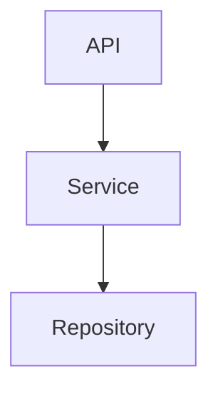

# Architecture Specification

> Generated by spec-gen v1.0.0 on 2026-04-30 11:33

## Purpose

This document describes the architectural patterns and structure of the system.

## Architecture Style

Layered architecture: HTTP routes → service layer → repository pattern over a database. This pattern
is chosen for its clarity, separation of concerns, and ease of maintenance.

## Requirements

### Requirement: LayeredArchitecture

The system SHALL maintain separation between:
- API (HTTP routing and input validation)
- Service (Business logic and orchestration)
- Repository (Data access and persistence)

#### Scenario: LayerSeparation
- **GIVEN** a request from the presentation layer
- **WHEN** business logic is needed
- **THEN** the presentation layer delegates to the business layer
- **AND** direct database access from presentation is prohibited

### Requirement: SecurityModel

The system SHALL implement security via: Google tokens for authentication; route middleware enforces authentication on all /api/* routes

#### Scenario: AuthenticatedAccess
- **GIVEN** an unauthenticated request
- **WHEN** accessing protected resources
- **THEN** access is denied

## System Diagram

## Layer Structure

### API

**Purpose**: HTTP routing and input validation
**Location**: `POST /api/feeds/poll, GET /api/jobs/pending, PATCH /api/jobs/{jobId}, GET /api/jobs/done/{feedName}, POST /api/feeds/rebuild/{feedName}, GET /api/config, GET /api/episodes/fetch, GET /api/episodes/seen, GET /api/health, POST /api/harvest, GET /api/feed, GET /api/episodes, GET /api/episodes/{episodeId}, POST /api/webhook`

### Service

**Purpose**: Business logic and orchestration
**Location**: `RSSTransformerService, UserAuthenticationService, TokenExpiryService, HistoryService, MediaProcessingService, FeedService, HarvestService, BridgeService`

### Repository

**Purpose**: Data access and persistence
**Location**: `User, Feed, Episode, Job, Podcast, Media`

## Data Flow

HTTP request → route handler → service → repository → database; async tasks via BridgeService

## External Integrations

| System | Purpose |
|--------|---------|
| Database | External integration |
| Google Authentication | External integration |
