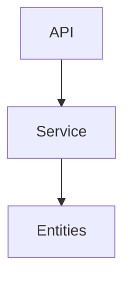

# Architecture Specification

> Generated by spec-gen v1.0.0 on 2026-04-24 22:59

## Purpose

This document describes the architectural patterns and structure of the system.

## Architecture Style

Monolithic architecture: The system is a single, unified unit with all components tightly coupled.
This pattern was chosen for simplicity and ease of deployment, given the relatively small scale of
the project.

## Requirements

### Requirement: LayeredArchitecture

The system SHALL maintain separation between:
- API (HTTP routing and input validation)
- Service (Business logic and orchestration)
- Entities (Data representation)

#### Scenario: LayerSeparation
- **GIVEN** a request from the presentation layer
- **WHEN** business logic is needed
- **THEN** the presentation layer delegates to the business layer
- **AND** direct database access from presentation is prohibited

### Requirement: SecurityModel

The system SHALL implement security via: No explicit authentication/authorization mechanism is evident from the provided analysis. This is a potential area for improvement.

#### Scenario: AuthenticatedAccess
- **GIVEN** an unauthenticated request
- **WHEN** accessing protected resources
- **THEN** access is denied

## System Diagram

## Layer Structure

### API

**Purpose**: HTTP routing and input validation
**Location**: `GET /artifacts, POST /episodes, GET /feed.xml, DELETE /episodes`

### Service

**Purpose**: Business logic and orchestration
**Location**: `HarvesterService`

### Entities

**Purpose**: Data representation
**Location**: `Artifact, Episode, Podcast, Media`

## Data Flow

HTTP request → route handler → service → entity operations → persistence; async processing of
artifacts to MP3 via HarvesterService

## External Integrations

| System | Purpose |
|--------|---------|
| NotebookLM API | External integration |
